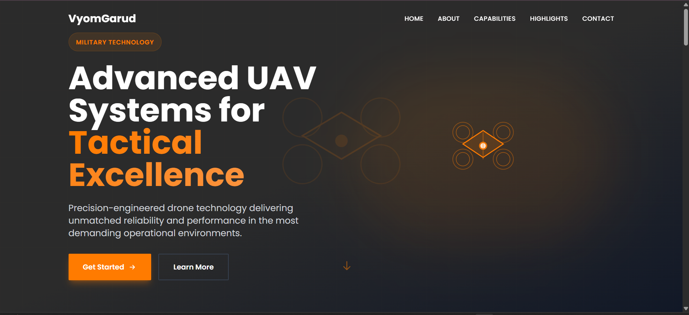
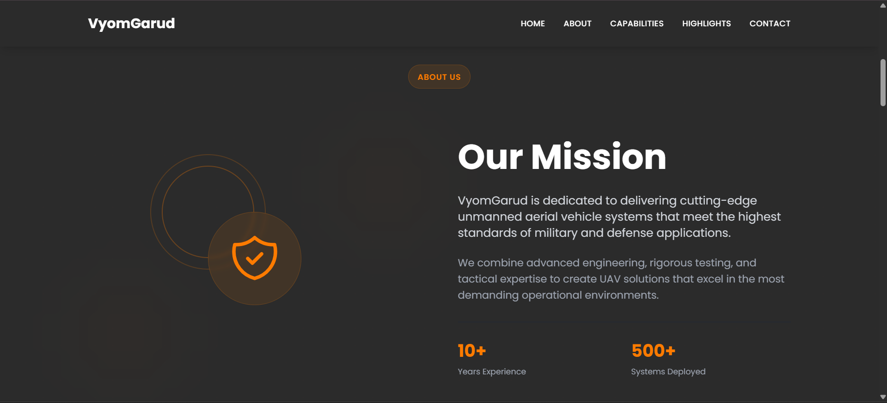
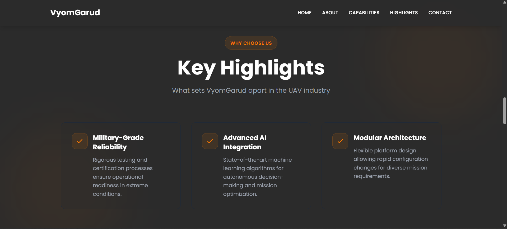

<div align="center">

# 🛡️ VyomGarud – UAV / Drone Systems Landing Page  
### Modern • Military-Grade • Futuristic • React + Tailwind CSS

A high-performance landing page for VyomGarud, built using **React (Vite)** and **Tailwind CSS**, inspired by  
[Onomondo](https://onomondo.com/) and [Raphe](https://www.raphe.com/).

---

</div>

## 🚀 Project Overview

VyomGarud is a **modern, responsive, military-grade landing page** designed for UAV & Drone Systems companies.  
It focuses on **precision**, **autonomy**, and **professional defense-grade aesthetics**.  
The UI uses a **dark charcoal theme**, **orange (#ff7b00) accents**, and smooth **Framer Motion animations**.

This repo includes:

- ⚛️ React frontend (Vite)
- 🎨 Tailwind CSS styling
- 🎬 Framer Motion animations
- 📱 Fully responsive layouts
- 🧩 Reusable JSX components
- 🌐 Optional Node.js backend for contact form

---

## 📂 Project Structure

VyomGuard/
├── client/ → React + Tailwind landing page (JSX only)
|
├── server/ → Optional Node.js backend (contact form)
|
├── README.md
|
└── .gitignore


---

## 🖥️ Screenshots

### 🏠 Home Section  


---

### 📘 About  


---

### ⭐ Highlights  


---

## 🛠️ Tech Stack

### **Frontend**
- React (Vite)
- Tailwind CSS
- Framer Motion
- Google Fonts: Poppins / Inter / Montserrat

### **Backend (Optional)**
- Node.js  
- Express.js  

---

## ⚙️ Installation & Setup

### 1️⃣ Clone the Repository
```sh
git clone https://github.com/JaganReddy-33/vyomgarud-landing-page.git
cd VyomGuard
▶️ Client Setup (React + Tailwind)
cd client
npm install
npm run dev
The app runs at: http://localhost:5173

▶️ Server Setup (Optional)
cd server
npm install
node server.js
Runs at: http://localhost:3001